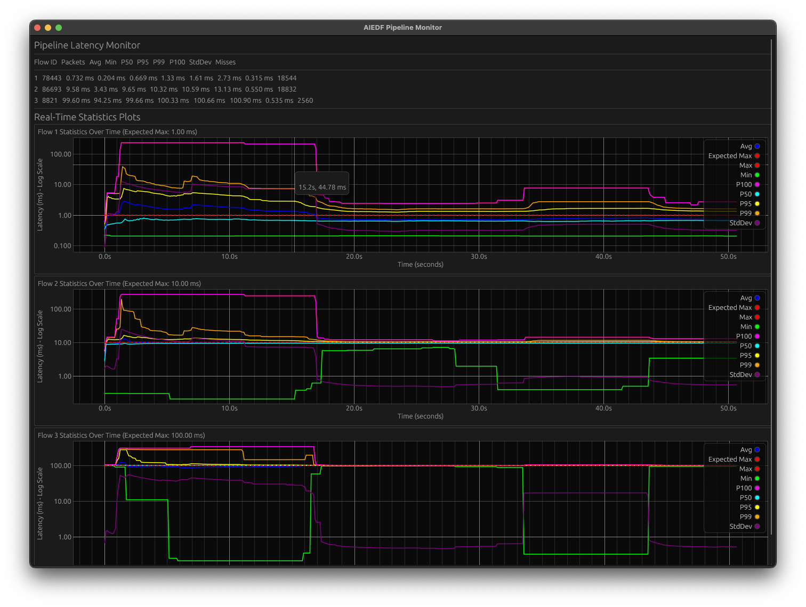

# AIEDF Pipeline

AIEDF Pipeline is a Rust scheduling stack that combines Deficit Round Robin (DRR) and Earliest Deadline First (EDF) to service latency-sensitive UDP workloads on a single three-core virtual machine. The codebase focuses on minimizing contention, exposing clear configuration points, and keeping metrics reporting isolated on a best-effort core.

## Highlights
- DRR on ingress and egress to shield low-bandwidth, low-latency flows from bulk traffic.
- EDF in the processing stage with size-aware simulated workloads (0.2–0.4 ms based on payload length).
- Four latency classes backed by the `Priority` enum: `High` (1 ms budget), `Medium` (10 ms), `Low` (100 ms), and `BestEffort` (utility traffic such as metrics).
- Pipeline wiring driven by `PipelineConfig`, allowing queue capacities, DRR quanta, EDF depth, and core assignments to change without touching function signatures.
- Metrics transport, DRR/EDF drop counters, and GUI updates executed on the best-effort core to keep real-time flows deterministic.
- `PriorityTable<T>` abstraction removes the need to edit interfaces when adding new priority classes.

## Default Architecture
1. **Ingress DRR** (`src/ingress_drr.rs`)
   - Reads packets from non-blocking UDP sockets.
   - Per-priority quantum defaults: High 16, Medium 4, Low/BestEffort 1 (packet-count based).
   - Routes packets into bounded crossbeam channels sized by `config.queues.ingress_to_edf` (defaults 16 per class).
   - Tracks drops per priority when channels are full.
2. **EDF Processor** (`src/edf_scheduler.rs`)
   - Maintains a single pending slot per priority and always executes the earliest deadline among head packets.
   - Simulates processing time proportional to payload size while keeping a 0.2 ms base duration.
   - Forwards packets to per-priority bounded channels, recording output drops when saturated.
3. **Egress DRR** (`src/egress_drr.rs`)
   - Pulls in priority order, records latency/deadline metrics, and emits via non-blocking Tokio UDP sockets.
   - Metrics events are sent via a lock-free channel to the collector.
4. **Metrics Collector** (`src/metrics.rs`)
   - Runs on the best-effort core, aggregates latency statistics, queue fill levels, and drop counters.
   - Broadcasts JSON snapshots over TCP (`127.0.0.1:9999`) for the GUI.

### Core Layout
The default `CoreAssignment` pins long-running threads to distinct cores:
- Core 0: ingress DRR runtime.
- Core 1: EDF processor.
- Core 2: egress DRR runtime and metrics/statistics thread (best-effort lane).

Change the mapping through `PipelineConfig::cores` to suit your deployment.

## Configuration Surface
`PipelineConfig` (see `src/pipeline.rs`) centralizes tunables:

```rust
PipelineConfig {
    cores: CoreAssignment { ingress: 0, edf: 1, egress: 2 },
    queues: QueueConfig {
        ingress_to_edf: PriorityTable::from_fn(|_| 16),
        edf_to_egress: PriorityTable::from_fn(|_| 16),
    },
    ingress: IngressSchedulerConfig {
        quantums: PriorityTable::from_fn(|priority| match priority {
            Priority::High => 16,
            Priority::Medium => 4,
            Priority::Low | Priority::BestEffort => 1,
        }),
    },
    edf: EdfSchedulerConfig { max_heap_size: 16 },
}
```

Adjust queue capacities, DRR quanta, EDF depth, or core affinity by instantiating a custom `PipelineConfig` before calling `Pipeline::new`. Because the API relies on `PriorityTable`, adding new classes only requires extending `Priority::ALL` and providing defaults.

## Building
```bash
cargo build --release
```

Rust 1.74+ is recommended. Linux and macOS are fully supported; macOS ignores CPU affinity but preserves thread naming and QoS hints.

## Running the Pipeline
```bash
cargo run --release
```

The binary:
- Binds UDP inputs on `127.0.0.1:{8080,8081,8082}` for High/Medium/Low classes.
- Emits processed packets to `127.0.0.1:{9080,9081,9082}`.
- Starts the metrics TCP server on `127.0.0.1:9999` by default.
- Spawns ingress/egress runtimes plus a statistics thread pinned to the best-effort core.

Override the metrics bind address (IP or DNS name, optional port) with:

```bash
cargo run --release -- --metrics-bind=0.0.0.0:9999
```

If the port is omitted the default `9999` is used, e.g. `--metrics-host=metrics.internal`.

### GUI Client
Launch the egui dashboard after the pipeline is running:
```bash
cargo run --release --bin gui
```

The GUI subscribes to the metrics stream and visualizes latency percentiles, deadline misses, queue occupancy, and drop counters. A legend highlights ingress versus EDF drop sources on the plots.

> Replace `docs/gui-dashboard.png` with an actual screenshot and keep the reference below for convenience.



## Ports and Priority Mapping
| Priority     | Input Socket       | Output Socket      | Latency Budget |
|--------------|--------------------|--------------------|----------------|
| High         | 127.0.0.1:8080     | 127.0.0.1:9080     | 1 ms           |
| Medium       | 127.0.0.1:8081     | 127.0.0.1:9081     | 10 ms          |
| Low          | 127.0.0.1:8082     | 127.0.0.1:9082     | 100 ms         |
| Best Effort* | internal metrics   | (optional)         | none           |

\* Best-effort traffic is reserved for pipeline telemetry and background work. Expose a socket only if you want to forward those packets externally.

## Sending Test Traffic
Use any UDP client; the socket you choose sets the priority:
```bash
# High priority (1 ms budget)
echo -n "Hello" | nc -u 127.0.0.1 8080

# Medium priority (10 ms budget)
echo -n "World" | nc -u 127.0.0.1 8081

# Low priority (100 ms budget)
echo -n "Test" | nc -u 127.0.0.1 8082
```

Listen on the corresponding output ports to inspect processed packets:
```bash
nc -u -l 9080   # High
nc -u -l 9081   # Medium
nc -u -l 9082   # Low
```

Run the stress example to generate randomized payload sizes (0–1400 bytes) and verify latency isolation:
```bash
cargo run --example stress_test
```

## Metrics & Drops
The metrics collector aggregates per-priority statistics:
- Latency percentiles (P50/P95/P99/P99.9/P100) and averages.
- Deadline misses and budget compliance.
- Queue occupancy for both DRR↔EDF and EDF↔DRR channels.
- Drop counters sourced from ingress DRR (channel full) and EDF output channels.

Snapshots are reported over Best Effort and displayed in the GUI; the same data is available for external integrations by subscribing to the TCP stream.

## Testing
```bash
cargo test
```

Integration tests that bind UDP sockets are marked `#[ignore]` by default to avoid requiring elevated permissions. Run them explicitly if your environment allows raw socket access.

## Benchmarking
```bash
cargo bench
```

Use these results to compare scheduler parameter sets; the pipeline code is structured so alternative DRR/EDF implementations can share the same harness.

## Troubleshooting
- **High ingress drops**: Increase `queues.ingress_to_edf[priority]` or tune DRR quantum for affected priorities.
- **EDF output drops**: Raise `queues.edf_to_egress[priority]` or reduce simulated processing time by trimming payload sizes.
- **Metrics noise**: Verify the metrics thread is pinned to the best-effort core; adjust `cores.egress` if needed.
- **GUI connection errors**: Ensure the pipeline is listening on `127.0.0.1:9999` and that the GUI is launched after the pipeline.

## License
This project is licensed under the [MIT License](LICENSE).

